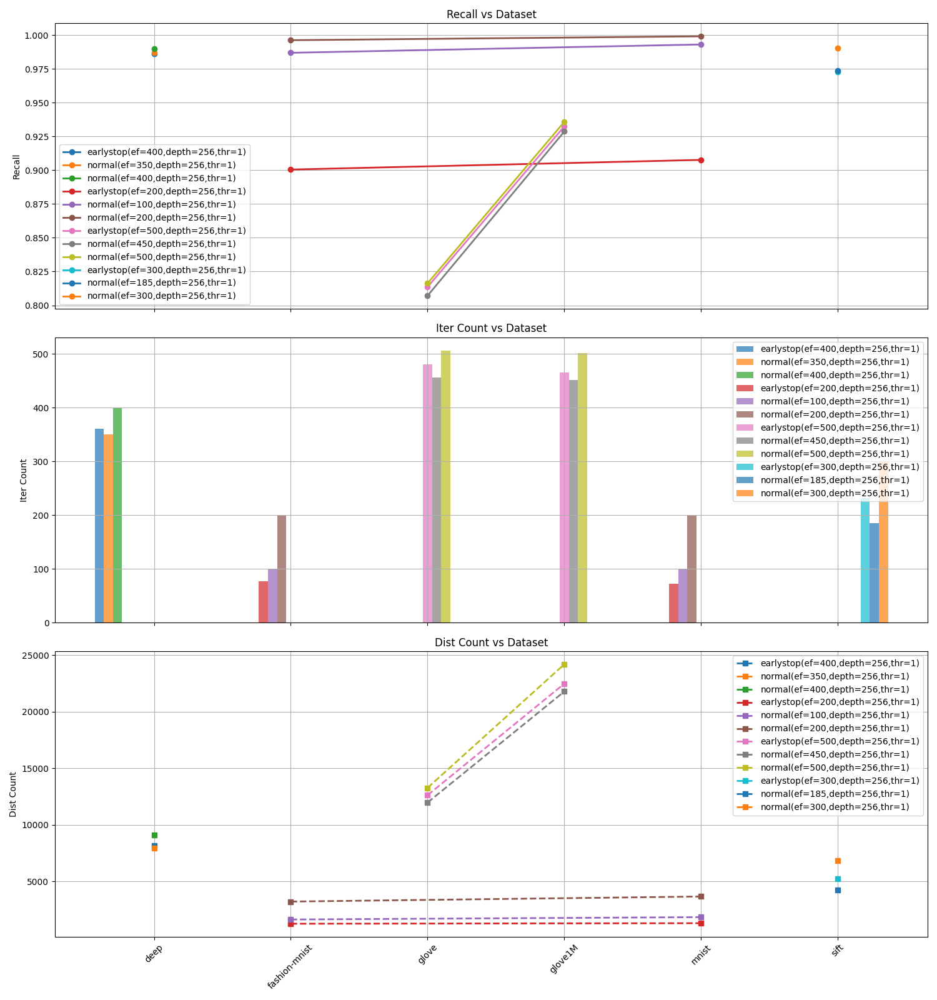

# Early-Stop vs Normal (Full Parameter Comparison)

## Table
| dataset       | method    |   ef |   iodepth |   threads | param_label                       |   recall |     iter |     dist |
|:--------------|:----------|-----:|----------:|----------:|:----------------------------------|---------:|---------:|---------:|
| deep          | earlystop |  400 |       256 |         1 | earlystop(ef=400,depth=256,thr=1) | 0.986298 | 361.033  |  8180.07 |
| deep          | normal    |  350 |       256 |         1 | normal(ef=350,depth=256,thr=1)    | 0.987066 | 350.454  |  7960.47 |
| deep          | normal    |  400 |       256 |         1 | normal(ef=400,depth=256,thr=1)    | 0.989786 | 400.404  |  9085.27 |
| fashion-mnist | earlystop |  200 |       256 |         1 | earlystop(ef=200,depth=256,thr=1) | 0.900456 |  77.5303 |  1262.94 |
| fashion-mnist | normal    |  100 |       256 |         1 | normal(ef=100,depth=256,thr=1)    | 0.986846 | 100.264  |  1637.18 |
| fashion-mnist | normal    |  200 |       256 |         1 | normal(ef=200,depth=256,thr=1)    | 0.996173 | 200.121  |  3222.16 |
| glove         | earlystop |  500 |       256 |         1 | earlystop(ef=500,depth=256,thr=1) | 0.813555 | 481.119  | 12620.8  |
| glove         | normal    |  450 |       256 |         1 | normal(ef=450,depth=256,thr=1)    | 0.80712  | 456.042  | 11971.5  |
| glove         | normal    |  500 |       256 |         1 | normal(ef=500,depth=256,thr=1)    | 0.816267 | 505.782  | 13270.2  |
| glove1M       | earlystop |  500 |       256 |         1 | earlystop(ef=500,depth=256,thr=1) | 0.932409 | 465.521  | 22475.2  |
| glove1M       | normal    |  450 |       256 |         1 | normal(ef=450,depth=256,thr=1)    | 0.928585 | 451.497  | 21782.6  |
| glove1M       | normal    |  500 |       256 |         1 | normal(ef=500,depth=256,thr=1)    | 0.935751 | 501.379  | 24186.4  |
| mnist         | earlystop |  200 |       256 |         1 | earlystop(ef=200,depth=256,thr=1) | 0.907611 |  72.4405 |  1310.08 |
| mnist         | normal    |  100 |       256 |         1 | normal(ef=100,depth=256,thr=1)    | 0.993002 | 100.298  |  1846.13 |
| mnist         | normal    |  200 |       256 |         1 | normal(ef=200,depth=256,thr=1)    | 0.999045 | 200.162  |  3668.87 |
| sift          | earlystop |  300 |       256 |         1 | earlystop(ef=300,depth=256,thr=1) | 0.972507 | 231.961  |  5256.62 |
| sift          | normal    |  185 |       256 |         1 | normal(ef=185,depth=256,thr=1)    | 0.973706 | 185.593  |  4217.9  |
| sift          | normal    |  300 |       256 |         1 | normal(ef=300,depth=256,thr=1)    | 0.990321 | 300.387  |  6814.94 |

## Figures (3 Subplots with Different Parameters)

