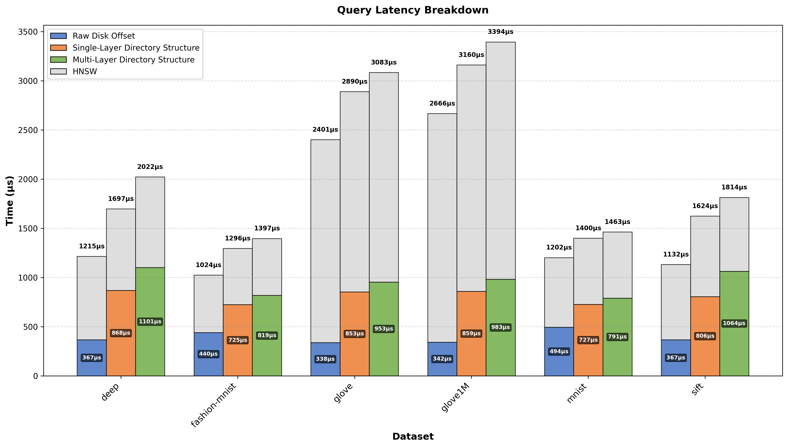

# 实验结果对比分析

本报告对比了三种不同实验配置（Offset、Fs、MultiLayer_Fs）在不同数据集上的性能表现。

## 结果汇总

### 平均耗时对比（单位：微秒）

| experiment   | dataset       |   avg_hnsw |   avg_hnswio |   avg_io |
|:-------------|:--------------|-----------:|-------------:|---------:|
| multi        | deep          |    921.292 |      2022.14 | 1100.84  |
| multi        | fashion-mnist |    577.813 |      1396.66 |  818.847 |
| multi        | glove         |   2129.71  |      3083.03 |  953.32  |
| multi        | glove1M       |   2411.04  |      3394.15 |  983.109 |
| multi        | mnist         |    672.785 |      1463.41 |  790.625 |
| multi        | sift          |    749.913 |      1813.72 | 1063.81  |
| offset       | deep          |    848.799 |      1215.44 |  366.645 |
| offset       | fashion-mnist |    583.967 |      1024.3  |  440.335 |
| offset       | glove         |   2062.94  |      2401.06 |  338.123 |
| offset       | glove1M       |   2323.46  |      2665.8  |  342.338 |
| offset       | mnist         |    708.719 |      1202.4  |  493.685 |
| offset       | sift          |    764.803 |      1131.51 |  366.708 |
| single       | deep          |    828.668 |      1696.71 |  868.041 |
| single       | fashion-mnist |    570.786 |      1295.58 |  724.797 |
| single       | glove         |   2036.82  |      2889.51 |  852.691 |
| single       | glove1M       |   2301.05  |      3160.36 |  859.306 |
| single       | mnist         |    673.285 |      1399.9  |  726.618 |
| single       | sift          |    817.663 |      1624.02 |  806.359 |

### 按数据集分组对比

#### deep

| experiment   |   avg_hnsw |   avg_hnswio |   avg_io |
|:-------------|-----------:|-------------:|---------:|
| multi        |    921.292 |      2022.14 | 1100.84  |
| offset       |    848.799 |      1215.44 |  366.645 |
| single       |    828.668 |      1696.71 |  868.041 |

#### fashion-mnist

| experiment   |   avg_hnsw |   avg_hnswio |   avg_io |
|:-------------|-----------:|-------------:|---------:|
| multi        |    577.813 |      1396.66 |  818.847 |
| offset       |    583.967 |      1024.3  |  440.335 |
| single       |    570.786 |      1295.58 |  724.797 |

#### glove

| experiment   |   avg_hnsw |   avg_hnswio |   avg_io |
|:-------------|-----------:|-------------:|---------:|
| multi        |    2129.71 |      3083.03 |  953.32  |
| offset       |    2062.94 |      2401.06 |  338.123 |
| single       |    2036.82 |      2889.51 |  852.691 |

#### glove1M

| experiment   |   avg_hnsw |   avg_hnswio |   avg_io |
|:-------------|-----------:|-------------:|---------:|
| multi        |    2411.04 |      3394.15 |  983.109 |
| offset       |    2323.46 |      2665.8  |  342.338 |
| single       |    2301.05 |      3160.36 |  859.306 |

#### mnist

| experiment   |   avg_hnsw |   avg_hnswio |   avg_io |
|:-------------|-----------:|-------------:|---------:|
| multi        |    672.785 |      1463.41 |  790.625 |
| offset       |    708.719 |      1202.4  |  493.685 |
| single       |    673.285 |      1399.9  |  726.618 |

#### sift

| experiment   |   avg_hnsw |   avg_hnswio |   avg_io |
|:-------------|-----------:|-------------:|---------:|
| multi        |    749.913 |      1813.72 | 1063.81  |
| offset       |    764.803 |      1131.51 |  366.708 |
| single       |    817.663 |      1624.02 |  806.359 |

### 图表对比

