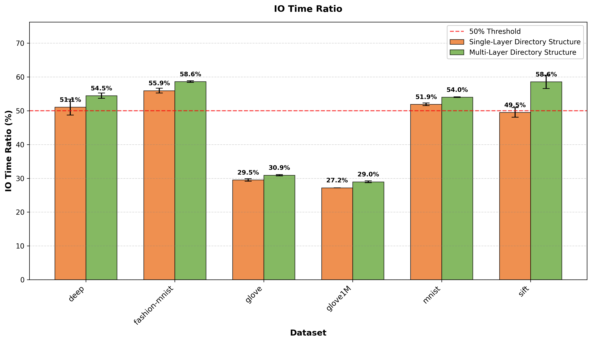
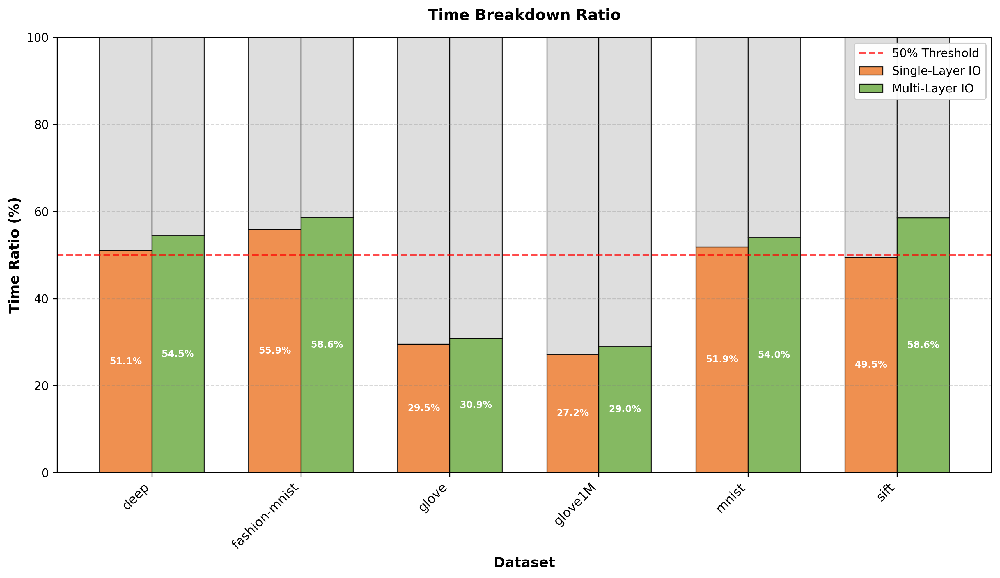

# IO Time Ratio Analysis

本报告分析了单层和多层文件系统结构的IO时间占比。

## 结果汇总

### IO时间占比对比（单位：%）

| Method   | Dataset       |   IO Ratio (%) |   HNSW Ratio (%) |   Avg IO Time (μs) |   Avg Total Time (μs) |
|:---------|:--------------|---------------:|-----------------:|-------------------:|----------------------:|
| multi    | deep          |          54.46 |            45.54 |           1100.84  |               2022.14 |
| multi    | fashion-mnist |          58.64 |            41.36 |            818.847 |               1396.66 |
| multi    | glove         |          30.92 |            69.08 |            953.32  |               3083.03 |
| multi    | glove1M       |          28.97 |            71.03 |            983.109 |               3394.15 |
| multi    | mnist         |          54.03 |            45.97 |            790.625 |               1463.41 |
| multi    | sift          |          58.56 |            41.44 |           1063.81  |               1813.72 |
| single   | deep          |          51.08 |            48.92 |            868.041 |               1696.71 |
| single   | fashion-mnist |          55.95 |            44.05 |            724.797 |               1295.58 |
| single   | glove         |          29.51 |            70.49 |            852.691 |               2889.51 |
| single   | glove1M       |          27.19 |            72.81 |            859.306 |               3160.36 |
| single   | mnist         |          51.91 |            48.09 |            726.618 |               1399.9  |
| single   | sift          |          49.51 |            50.49 |            806.359 |               1624.02 |

### 按数据集分组对比

#### deep

| Method   |   IO Ratio (%) |   HNSW Ratio (%) |   Avg IO Time (μs) |   Avg Total Time (μs) |
|:---------|---------------:|-----------------:|-------------------:|----------------------:|
| multi    |          54.46 |            45.54 |           1100.84  |               2022.14 |
| single   |          51.08 |            48.92 |            868.041 |               1696.71 |

#### fashion-mnist

| Method   |   IO Ratio (%) |   HNSW Ratio (%) |   Avg IO Time (μs) |   Avg Total Time (μs) |
|:---------|---------------:|-----------------:|-------------------:|----------------------:|
| multi    |          58.64 |            41.36 |            818.847 |               1396.66 |
| single   |          55.95 |            44.05 |            724.797 |               1295.58 |

#### glove

| Method   |   IO Ratio (%) |   HNSW Ratio (%) |   Avg IO Time (μs) |   Avg Total Time (μs) |
|:---------|---------------:|-----------------:|-------------------:|----------------------:|
| multi    |          30.92 |            69.08 |            953.32  |               3083.03 |
| single   |          29.51 |            70.49 |            852.691 |               2889.51 |

#### glove1M

| Method   |   IO Ratio (%) |   HNSW Ratio (%) |   Avg IO Time (μs) |   Avg Total Time (μs) |
|:---------|---------------:|-----------------:|-------------------:|----------------------:|
| multi    |          28.97 |            71.03 |            983.109 |               3394.15 |
| single   |          27.19 |            72.81 |            859.306 |               3160.36 |

#### mnist

| Method   |   IO Ratio (%) |   HNSW Ratio (%) |   Avg IO Time (μs) |   Avg Total Time (μs) |
|:---------|---------------:|-----------------:|-------------------:|----------------------:|
| multi    |          54.03 |            45.97 |            790.625 |               1463.41 |
| single   |          51.91 |            48.09 |            726.618 |               1399.9  |

#### sift

| Method   |   IO Ratio (%) |   HNSW Ratio (%) |   Avg IO Time (μs) |   Avg Total Time (μs) |
|:---------|---------------:|-----------------:|-------------------:|----------------------:|
| multi    |          58.56 |            41.44 |           1063.81  |               1813.72 |
| single   |          49.51 |            50.49 |            806.359 |               1624.02 |

### 统计信息

- **Single-Layer平均IO占比**: 44.19%
- **Single-Layer最大IO占比**: 55.95%
- **Single-Layer最小IO占比**: 27.19%
- **Single-Layer超过50%的数据集数量**: 3/6

- **Multi-Layer平均IO占比**: 47.60%
- **Multi-Layer最大IO占比**: 58.64%
- **Multi-Layer最小IO占比**: 28.97%
- **Multi-Layer超过50%的数据集数量**: 4/6

### 图表对比

