# 线程维度对比分析

本报告包含：
1) 指定实验方案在不同线程下、不同数据集的对比结果；
2) 指定线程数下，多种方案的对比结果；
3) 指定数据集下，多种方案随线程变化的对比结果。

## 汇总结果（均值，单位：μs）

| experiment   | dataset       |   threads |   avg_hnsw |    avg_io |   avg_hnswio |   io_ratio |   hnsw_ratio |
|:-------------|:--------------|----------:|-----------:|----------:|-------------:|-----------:|-------------:|
| multi        | deep          |         1 |    921.292 | 1100.84   |     2022.14  |   54.4396  |      45.5604 |
| multi        | deep          |         2 |   1111.09  | 1136.29   |     2247.38  |   50.5607  |      49.4393 |
| multi        | deep          |         4 |   1334.69  | 1176.96   |     2511.65  |   46.86    |      53.14   |
| multi        | fashion-mnist |         1 |    577.813 |  818.847  |     1396.66  |   58.6289  |      41.3711 |
| multi        | fashion-mnist |         2 |    618.738 |  831.074  |     1449.81  |   57.3229  |      42.6771 |
| multi        | fashion-mnist |         4 |    702.93  |  909.01   |     1611.94  |   56.3923  |      43.6077 |
| multi        | glove         |         1 |   2129.71  |  953.32   |     3083.03  |   30.9215  |      69.0785 |
| multi        | glove         |         2 |   3189.03  | 1064.63   |     4253.66  |   25.0285  |      74.9715 |
| multi        | glove         |         4 |   3321.64  | 1074.24   |     4395.89  |   24.4375  |      75.5625 |
| multi        | glove1M       |         1 |   2411.04  |  983.109  |     3394.15  |   28.9648  |      71.0352 |
| multi        | glove1M       |         2 |   2827.63  | 1037.07   |     3864.69  |   26.8344  |      73.1656 |
| multi        | glove1M       |         4 |   3469.5   | 1084.93   |     4554.43  |   23.8215  |      76.1785 |
| multi        | mnist         |         1 |    672.785 |  790.625  |     1463.41  |   54.0262  |      45.9738 |
| multi        | mnist         |         2 |    758.528 |  843.718  |     1602.25  |   52.6585  |      47.3415 |
| multi        | mnist         |         4 |    913.36  |  891.619  |     1804.98  |   49.3977  |      50.6023 |
| multi        | sift          |         1 |    749.913 | 1063.81   |     1813.72  |   58.6534  |      41.3466 |
| multi        | sift          |         2 |    963.505 | 1188.62   |     2152.13  |   55.2301  |      44.7699 |
| multi        | sift          |         4 |   1193.77  | 1173.26   |     2367.04  |   49.5668  |      50.4332 |
| offset       | deep          |         1 |    848.799 |  366.645  |     1215.44  |   30.1655  |      69.8345 |
| offset       | deep          |         2 |    989.471 |  419.122  |     1408.59  |   29.7546  |      70.2454 |
| offset       | deep          |         4 |    984.538 |  485.653  |     1470.19  |   33.0333  |      66.9667 |
| offset       | deep          |         8 |   1263.01  |  687.477  |     1950.49  |   35.2464  |      64.7536 |
| offset       | deep          |        16 |   1913.9   |  931.758  |     2845.66  |   32.7432  |      67.2568 |
| offset       | fashion-mnist |         1 |    583.967 |  440.335  |     1024.3   |   42.9888  |      57.0112 |
| offset       | fashion-mnist |         2 |    628.404 |  539.089  |     1167.49  |   46.1749  |      53.8251 |
| offset       | fashion-mnist |         4 |    676.955 |  579.24   |     1256.2   |   46.1107  |      53.8893 |
| offset       | fashion-mnist |         8 |    935.74  |  912.306  |     1848.05  |   49.366   |      50.634  |
| offset       | fashion-mnist |        16 |   1238.64  | 1005.09   |     2243.73  |   44.7956  |      55.2044 |
| offset       | glove         |         1 |   2062.94  |  338.123  |     2401.06  |   14.0822  |      85.9178 |
| offset       | glove         |         2 |   2462.77  |  343.56   |     2806.33  |   12.2423  |      87.7577 |
| offset       | glove         |         4 |   2490.49  |  356.639  |     2847.13  |   12.5263  |      87.4737 |
| offset       | glove         |         8 |   3743.84  |  434.236  |     4178.07  |   10.3932  |      89.6068 |
| offset       | glove         |        16 |   5976.38  |  546.688  |     6523.07  |    8.38084 |      91.6192 |
| offset       | glove1M       |         1 |   2323.46  |  342.338  |     2665.8   |   12.8419  |      87.1581 |
| offset       | glove1M       |         2 |   2636.24  |  355.902  |     2992.15  |   11.8945  |      88.1055 |
| offset       | glove1M       |         4 |   2625.38  |  355.126  |     2980.5   |   11.915   |      88.085  |
| offset       | glove1M       |         8 |   3807.58  |  416.758  |     4224.33  |    9.86564 |      90.1344 |
| offset       | glove1M       |        16 |   6110.25  |  518.827  |     6629.07  |    7.82654 |      92.1735 |
| offset       | mnist         |         1 |    708.719 |  493.685  |     1202.4   |   41.0582  |      58.9418 |
| offset       | mnist         |         2 |    755.493 |  530.167  |     1285.66  |   41.2369  |      58.7631 |
| offset       | mnist         |         4 |    811.178 |  646.957  |     1458.14  |   44.3688  |      55.6312 |
| offset       | mnist         |         8 |   1151.57  |  906.275  |     2057.85  |   44.0399  |      55.9601 |
| offset       | mnist         |        16 |   1461.82  | 1113.86   |     2575.69  |   43.2453  |      56.7547 |
| offset       | sift          |         1 |    764.803 |  366.708  |     1131.51  |   32.4087  |      67.5913 |
| offset       | sift          |         2 |    861.678 |  424.802  |     1286.48  |   33.0205  |      66.9795 |
| offset       | sift          |         4 |    865.021 |  496.881  |     1361.9   |   36.4843  |      63.5157 |
| offset       | sift          |         8 |   1167.41  |  642.582  |     1810     |   35.5018  |      64.4982 |
| offset       | sift          |        16 |   1875.12  |  826.621  |     2701.74  |   30.5958  |      69.4042 |
| single       | deep          |         1 |    828.668 |  868.041  |     1696.71  |   51.1603  |      48.8397 |
| single       | deep          |         2 |   1061.44  | 1256.48   |     2317.92  |   54.2072  |      45.7928 |
| single       | deep          |         4 |   1505.65  | 1225.1    |     2730.74  |   44.8631  |      55.1369 |
| single       | deep          |         8 |   1505.04  | 1286.09   |     2791.13  |   46.0776  |      53.9224 |
| single       | deep          |        16 |   3262.19  | 1716.51   |     4978.71  |   34.4771  |      65.5229 |
| single       | fashion-mnist |         1 |    570.786 |  724.797  |     1295.58  |   55.9437  |      44.0563 |
| single       | fashion-mnist |         2 |    695.128 |  223.758  |      918.886 |   24.351   |      75.649  |
| single       | fashion-mnist |         4 |    959.247 |   48.405  |     1007.65  |    4.80374 |      95.1963 |
| single       | fashion-mnist |         8 |    951.362 |   63.4254 |     1014.79  |    6.25011 |      93.7499 |
| single       | fashion-mnist |        16 |   1333.49  | 1435.44   |     2768.93  |   51.8411  |      48.1589 |
| single       | glove         |         1 |   2036.82  |  852.691  |     2889.51  |   29.5099  |      70.4901 |
| single       | glove         |         2 |   2830.58  |  423.741  |     3254.32  |   13.0209  |      86.9791 |
| single       | glove         |         4 |   3371.62  |   34.1095 |     3405.73  |    1.00153 |      98.9985 |
| single       | glove         |         8 |   4237.61  |   70.1108 |     4307.72  |    1.62756 |      98.3724 |
| single       | glove         |        16 |   6196.58  | 1139.05   |     7335.63  |   15.5276  |      84.4724 |
| single       | glove1M       |         1 |   2301.05  |  859.306  |     3160.36  |   27.1902  |      72.8098 |
| single       | glove1M       |         2 |   2836.33  | 1149.54   |     3985.87  |   28.8403  |      71.1597 |
| single       | glove1M       |         4 |   3142.84  |   36.5923 |     3179.43  |    1.15091 |      98.8491 |
| single       | glove1M       |         8 |   4360.75  |  426.113  |     4786.86  |    8.90171 |      91.0983 |
| single       | glove1M       |        16 |   6622.78  | 1175.08   |     7797.86  |   15.0693  |      84.9307 |
| single       | mnist         |         1 |    673.285 |  726.618  |     1399.9   |   51.9049  |      48.0951 |
| single       | mnist         |         2 |    771.616 |  495.095  |     1266.71  |   39.0851  |      60.9149 |
| single       | mnist         |         4 |   1034.61  |  225.631  |     1260.24  |   17.9039  |      82.0961 |
| single       | mnist         |         8 |   1168.84  |   49.7132 |     1218.56  |    4.07968 |      95.9203 |
| single       | mnist         |        16 |   1613.31  | 1352.74   |     2966.05  |   45.6076  |      54.3924 |
| single       | sift          |         1 |    817.663 |  806.359  |     1624.02  |   49.652   |      50.348  |
| single       | sift          |         2 |    980.506 | 1189.41   |     2169.91  |   54.8136  |      45.1864 |
| single       | sift          |         4 |   1133.78  | 1526.42   |     2660.2   |   57.3798  |      42.6202 |
| single       | sift          |         8 |   1290.08  | 1522.44   |     2812.52  |   54.1309  |      45.8691 |
| single       | sift          |        16 |   2634.92  | 1634.3    |     4269.22  |   38.281   |      61.719  |

## 图表

### offset 方案在不同线程下的结果

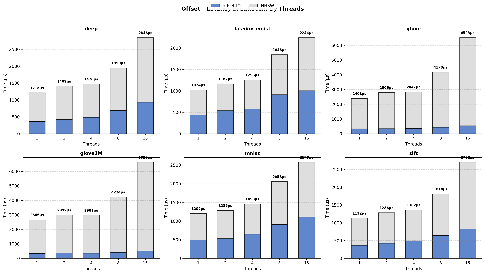

### single 方案在不同线程下的结果

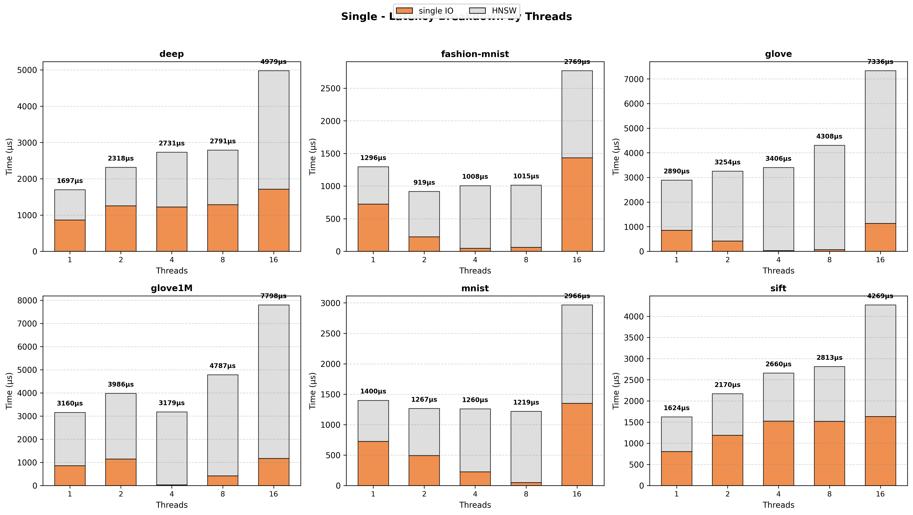

### multi 方案在不同线程下的结果

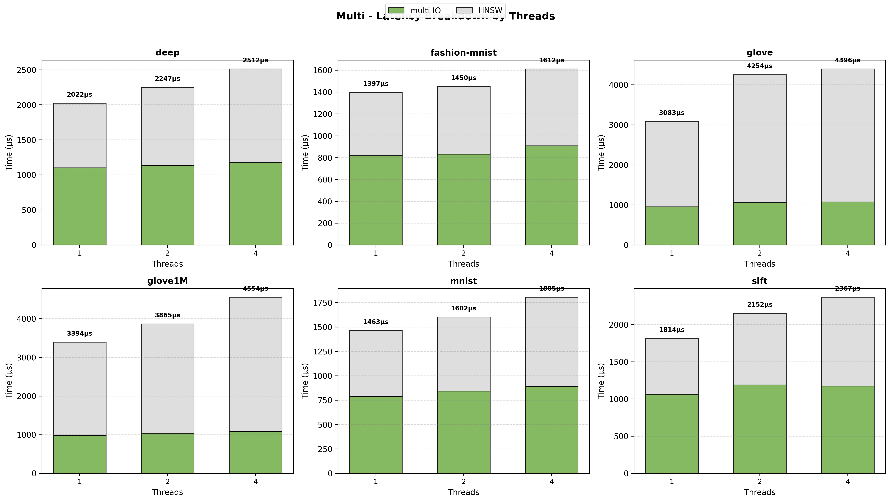

### 不同方案在 1 线程下的结果

### 不同方案在 2 线程下的结果

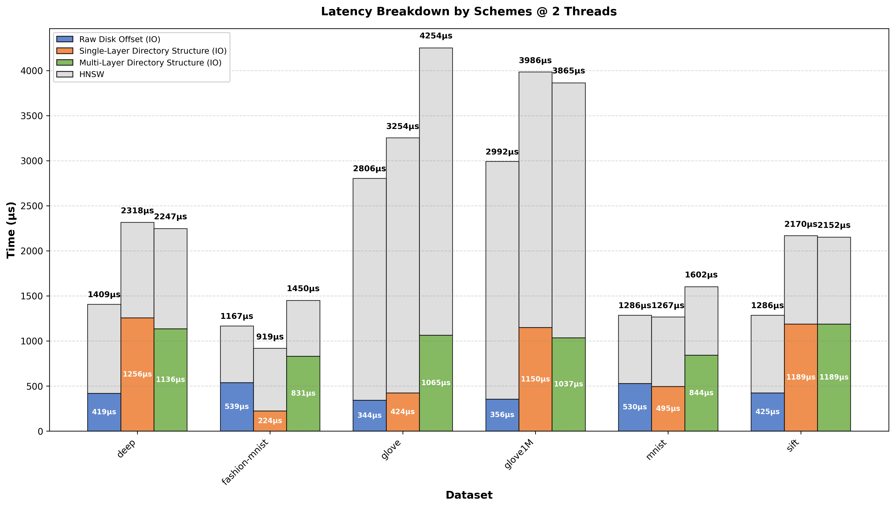

### 不同方案在 4 线程下的结果

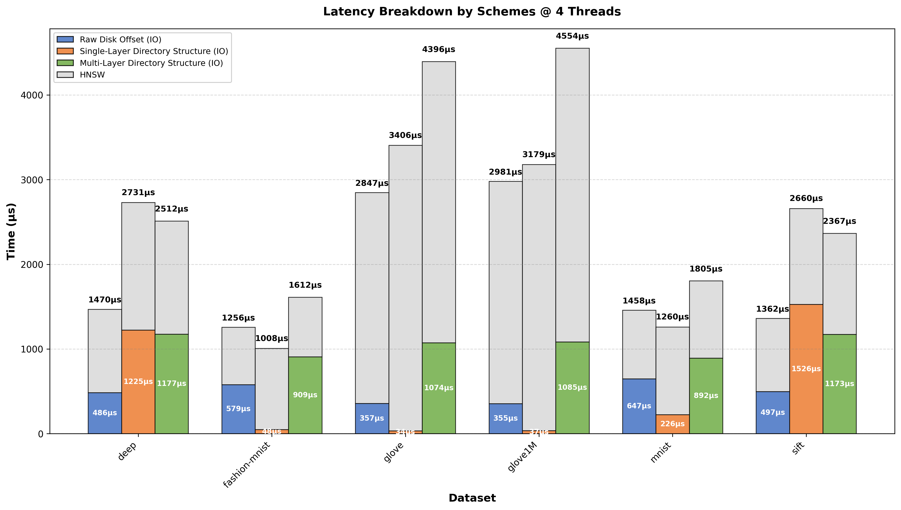

### 不同方案在 8 线程下的结果

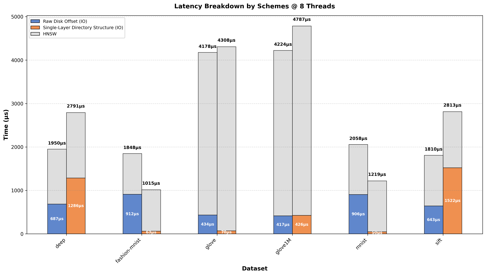

### 不同方案在 16 线程下的结果

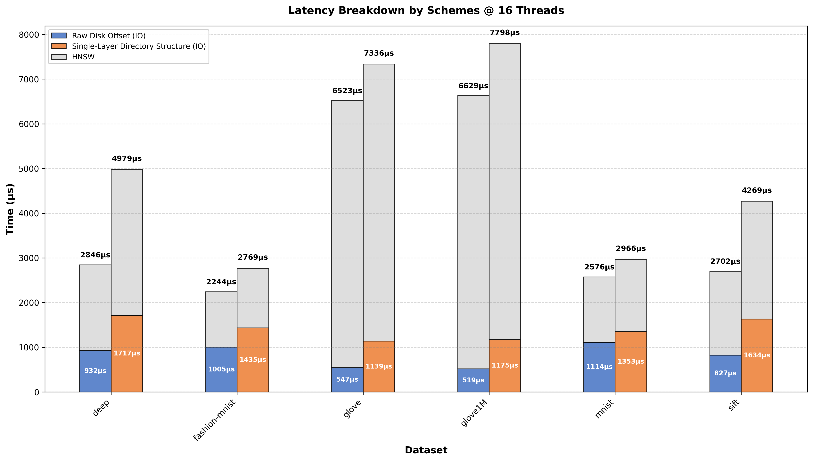

### 数据集 deep 下不同方案随线程变化结果

### 数据集 fashion-mnist 下不同方案随线程变化结果

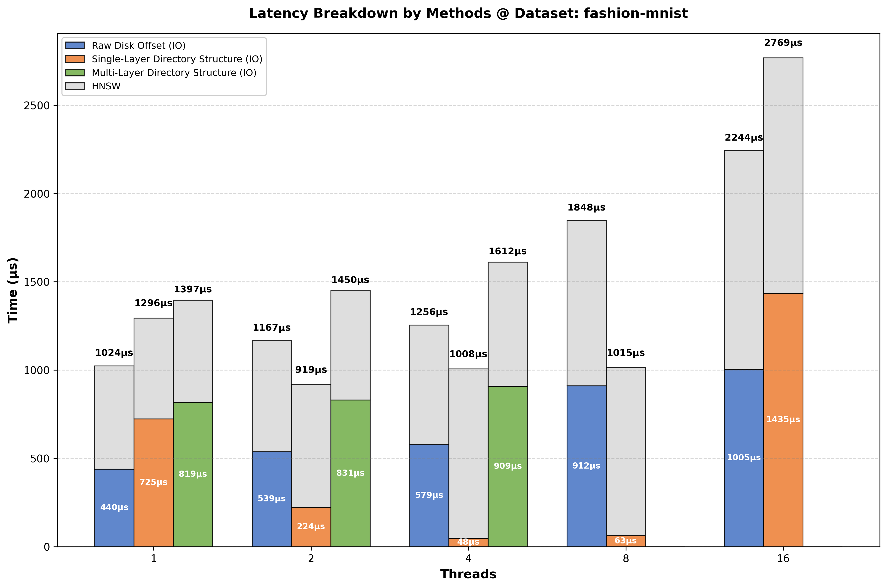

### 数据集 glove 下不同方案随线程变化结果

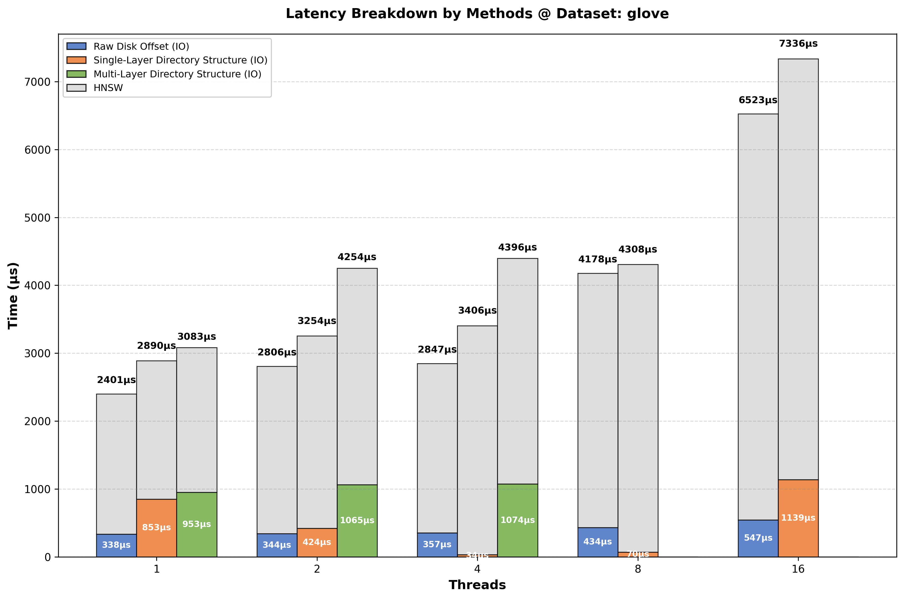

### 数据集 glove1M 下不同方案随线程变化结果

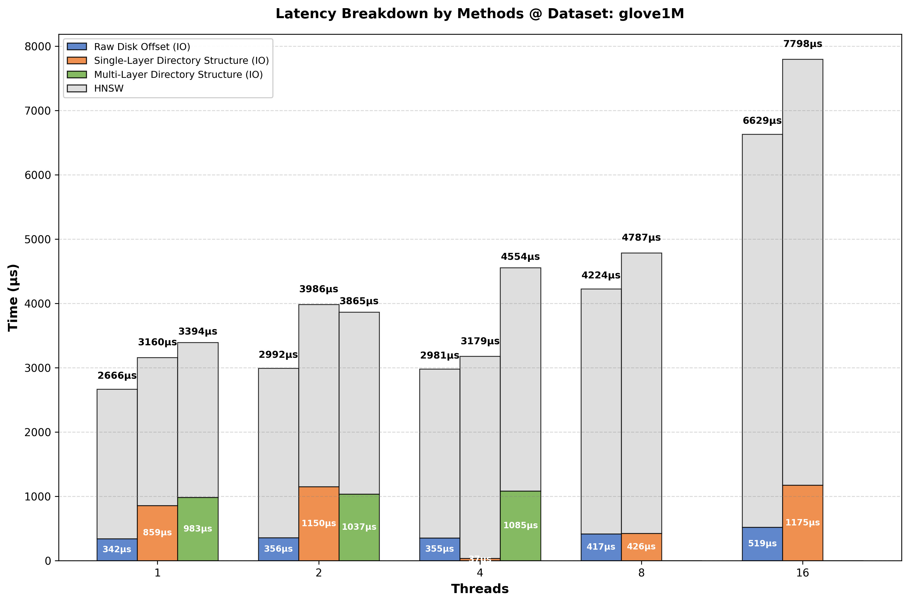

### 数据集 mnist 下不同方案随线程变化结果

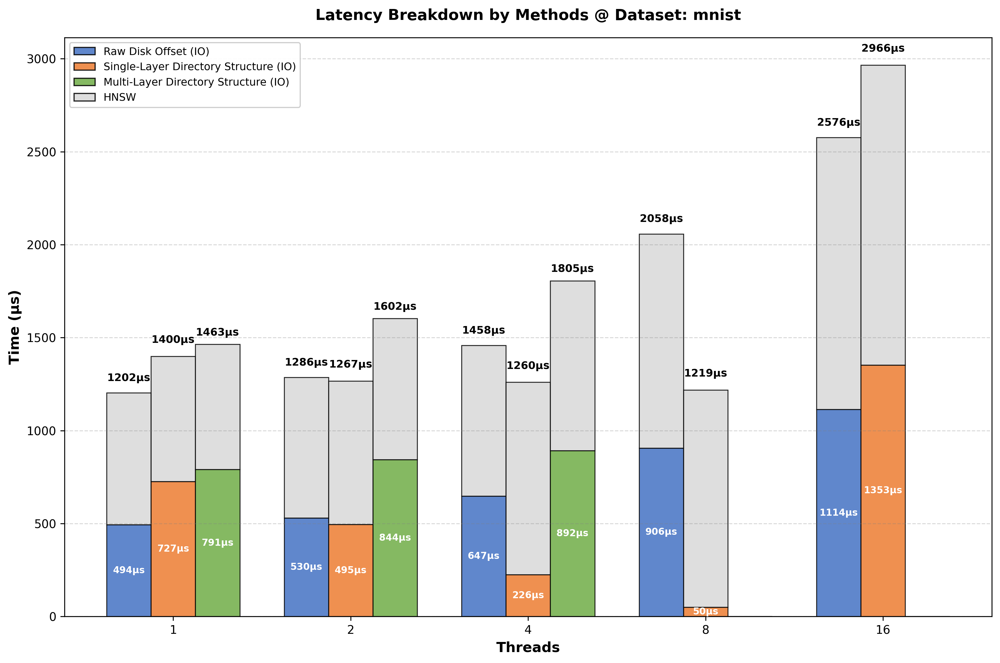

### 数据集 sift 下不同方案随线程变化结果

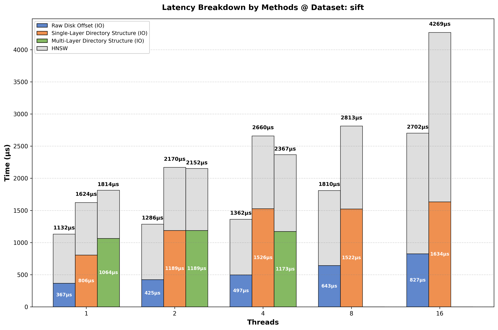

